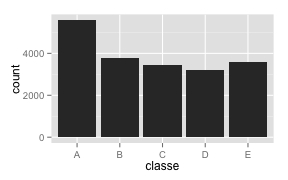

#Introduction

This project is an application of Machine Learning techniques to a specific case of Human Activity Recognition (HAR). According to the source of the data, linked below, HAR typically focuses on discriminating between different activities, i.e. to predict "which" activity was performed at a specific point in time. However, in this case, we seek to examine and classify how *well* a specific activity was performed by the user. As one might imagine, this is a timely question: as personal activity monitors become increasingly pervasive and tools like smartphones develop increasingly sophisticated capacities to monitor and record such data, the demand for making use of data on the efficacy of physical tasks performed by users will undoubtedly continue to increase.

To read more about this dataset, to view the publication it was originally developed for, or to learn more about HAR, visit the source for the data here: http://groupware.les.inf.puc-rio.br/har#weight_lifting_exercises#ixzz3SQNYLCP3


##Exploratory analysis

This dataset contains recordings from accelerometers placed on the belt, forearm, arm, and dumbell of 6 participants. They were asked to perform barbell lifts correctly and incorrectly in 5 different ways. The training set contains 19622 observations of 160 variables, and the test set contains 20 observations of as many variables.

*Note: this code assumes the user has data downloaded and saved in a directory with the specified location; alter this to reflect the correct directory if data is located elsewhere. The data can be obtained at https://d396qusza40orc.cloudfront.net/predmachlearn/pml-training.csv (training data) and https://d396qusza40orc.cloudfront.net/predmachlearn/pml-testing.csv (testing data).* 


```r
setwd("~/Documents/Coursera/Practical Machine Learning/Project/Data")
test <- read.csv("pml-testing.csv", na.strings=c("","NA"))
train <- read.csv("pml-training.csv", na.strings=c("","NA"))
```

The variable of interest to the predictive model constructed here is the 'classe' variable (or the "exercise class"), so I will briefly examine that here. According to the data source, the classes are as follows:

*Class A: exactly according to the specification
*Class B: throwing the elbows to the front
*Class C: lifting the dumbbell only halfway
*Class D: lowering the dumbbell only halfway
*Class E: throwing the hips to the front

Class A corresponds to the specified execution of the exercise, while the other 4 classes correspond to common mistakes. 


```r
library(ggplot2)
ggplot(train, aes(x = classe)) + geom_histogram()
```



The training set includes over 3000 instances of each of the exercise classes, which suggests that we have sufficient data to train our model to predict each class. 


#Data cleaning and processing

In addition to being very large, sensor data can also be quite messy--this dataset is no exception. Here, we immediately see a very large number of variables with missing values.


```r
library(plyr)
NAcount <- as.data.frame(sapply(train, function(x) sum(is.na(x))))
NAcount <- cbind(names(train), NAcount)
names(NAcount) <- c("variable" , "count")

table(NAcount$count)
```

```
## 
##     0 19216 
##    60   100
```

As we can see above, there are 100 variables in the training set that are missing in all 19216 instances, while the remaining 60 variables are complete in all cases. The variables which consist of entirely NA values may be due to a faulty sensor, data collection or entry errors, or a variety of other factors. Being unable to investigate why these may be missing, and seeing as they add no predictive power to our model as the dataset stands, I elected to remove them. I did this by selecting only those variables of the training dataset which have zero missing values, as calculated in the 'NAcount' data generated above (note that, as shown above, all variables in the dataset contained either zero missing values or were entirely missing):


```r
cleantrain <- train[,NAcount$count==0]
```

As noted above, because there were no other missing values in the dataset, no imputation of missing values was necessary--at this point, all observations contain only complete cases. However, if it were necessary, imputation would have been performed at this point.

Before passing this data to a model, it was also important to evaluate which variables to use to train the model. For the purposes of modeling, this dataset contains variables that are likely to not add to the predictiveness of our model, or even confound it. The first seven columns of the training set (and the new cleantrain dataset generated above) contain measures which are not relevant to prediction, at least in the contexts in which we might want to evaluate exercise technique. These include the index number of the observation, name of the subject that performed the exercise, timestamps, and window numbers for participants. Even if these are indeed predictive, as they may well be, in this case it would seem undesirable for our model to be sensitive to these parameters (for example, we want the model to evaluate based on accelerometer and movement data, not based on the timestamp or window of the observations, even though those may somehow be releated to the users' technique--the user could improve their technique as the experiment progresses). I remove those variables as well, preserving the original cleantrain data if needed:


```r
cleantrain2 <- cleantrain[,8:60]
```


#Model Creation and Evaluation

For modeling this dataset, I adopted a random forest model. As Hastie, Tibshirani, and Friedman write in *The Elements of Statistical Learning*, "random forests is a substantial modification of bagging that builds a large collection of *de-correlated* trees, and then averages them." This model was chosen for its accuracy and its ability to handle nonlinear data. Trees are able to handle complex interaction structures in data, and have relatively low bias if grown sufficiently deep. Additionally, since tree models are known to be quite noisy, the averaging implemented as part of the random forest model is extremely helpful as it serves to reduce their variance without affecting model bias.

Although a random forest model may be subject to challenges in interpretability, speed in model building, and overfitting, these were not major concerns in this case: the nature of this exercise favors predictiveness over interpretability, and we can therefore adopt more of a "black box" approach; I have already built the model and judged the model-building process to be acceptably speedy; and the large dataset (n = 19622 in training set) helps ensure a good model fit. We can also assess the potential of overfitting when examining the expected error statistics for the model and by applying it to the test set.

The model is generated below:
 


```r
set.seed(1919); modfit <- randomForest(classe ~ ., data = cleantrain2)
```

Model fit, error, and summary statistics are provided below:


```r
modfit
```

```
## 
## Call:
##  randomForest(formula = classe ~ ., data = cleantrain2) 
##                Type of random forest: classification
##                      Number of trees: 500
## No. of variables tried at each split: 7
## 
##         OOB estimate of  error rate: 0.28%
## Confusion matrix:
##      A    B    C    D    E  class.error
## A 5578    1    0    0    1 0.0003584229
## B   10 3784    3    0    0 0.0034237556
## C    0    9 3411    2    0 0.0032144944
## D    0    0   20 3194    2 0.0068407960
## E    0    0    1    5 3601 0.0016634322
```

We immediately see that this model appears to be extremely strong when applied to the training set; the estimated error rate is a mere 0.28%. The model misclassified only 54 observations out of the nearly 20,000 observations in the test set. 

If one wished to increase the speed with which the model was built, a next step might be to prune the predictors used to build the model, selecting a subset of the strongest or most "important" predictors, calling a function such as varImp(modfit) to evaluate the importance of variables in this model (to preserve space, I do not reproduce the output of the function here). One could then rebuild a new random forest model using only those predictors that were most important to the model, gaining some speed and efficiency in model building and application while likely sacrificing little in terms of predictive power.


#Out of sample error and prediction of error using cross-validation

In random forests, there is no need for cross-validation or a separate test to obtain an unbiased estimate of the test set error. This calculation is performed during the building of the model: each tree is constructed using a different bootstrap sample from the original data, and the data left out in the construction of a given tree is passed through the tree to obtain a classification for each of those cases. The error rate of these left-out observations applied to the trees is the out of bag (OOB) error estimate. As Hastie, Tibshirani, and Friedman write in *The Elements of Statistical Learning*, "[a]n OOB error estimate is almost identical to that obtained by N-fold cross-validation." For this model, the estimated OOB error rate is 0.28% (see above).

In addition, predictions for the test data are shown below (note: the test data is transformed to exclude the same variables as above, so the model only predicts on variables it was trained on):


```r
cleantest <- test[,NAcount$count==0]
cleantest2 <- cleantest[,8:60]
predict(modfit, cleantest2)
```

```
##  1  2  3  4  5  6  7  8  9 10 11 12 13 14 15 16 17 18 19 20 
##  B  A  B  A  A  E  D  B  A  A  B  C  B  A  E  E  A  B  B  B 
## Levels: A B C D E
```

I note here that these predictions exactly match the correct classifications for the test set, which is to say that the model has 100% accuracy on the testing set (although this should not be considered a statistically rigorous evaluation of model fit; the test set in this case consists of only 20 observations). This seems to support the extremely low OOB error rate calculated during the model build, but further evaluation on a larger test set would be necessary to confirm the model's out of sample performance.

